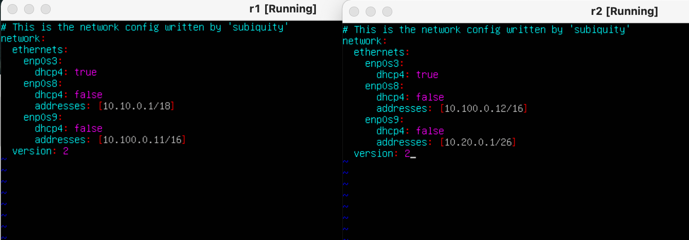

## Part 1. Инструмент **ipcalc**

#### 1. Сети и маски

1. Адрес сети *192.167.38.54/13*

2. Перевод маски *255.255.255.0* в префиксную и двоичную запись.

- */15* в обычную и двоичную.

- *11111111.11111111.11111111.11110000* в обычную и префиксную.

3. Минимальный и максимальный хост в сети *12.167.38.4* при масках: */8*, *11111111.11111111.00000000.00000000*, *255.255.254.0* и */4*.

#### 2. localhost.
##### Определим и запишем в отчёт, можно ли обратиться к приложению, работающему на localhost, со следующими IP:

*194.34.23.100* - нет
*127.0.0.2* - да
*127.1.0.1* - нет
*128.0.0.1* - нет

#### 3. Диапазоны и сегменты сетей.

##### 1. Какие из перечисленных IP можно использовать в качестве публичного, а какие только в качестве частных :

10.0.0.45 - частный
134.43.0.2 - публичный
192.168.4.2 - частный
172.20.250.4 - частный
172.0.2.1 - публичный
192.172.0.1 - публичный
172.68.0.2 - публичный
172.16.255.255 - частный
10.10.10.10 - частный
192.169.168.1 - публичный

##### 2. Какие из перечисленных IP адресов шлюза возможны у сети 
10.10.0.0/18 :

- 10.0.0.1  
- 10.10.0.2 - да
- 10.10.10.10 -да
- 10.10.100.1
- 10.10.1.255 - да

## Part 2. Статическая маршрутизация между двумя машинами.

##### С помощью команды `ip a` посмотрим существующие сетевые интерфейсы.
- ip a (ws1, ws2)

##### на обеих машинах зададим следующие адреса и маски:
- ws1 - *192.168.100.10*, маска */16*
- ws2 - *172.24.116.8*, маска */12*

##### Выполним команду `netplan apply` для перезапуска сервиса сети.

#### 1. Добавление статического маршрута вручную.
##### - Добавим статический маршрут от одной машины до другой и обратно при помощи команды вида `ip r add`.

##### - Пинг между машинами.

#### 2. Добавление статического маршрута с сохранением
##### - Добавим статический маршрут от одной машины до другой с помощью файла *etc/netplan/00-installer-config.yaml*.

##### - Пинг соединения между машинами.

## Part 3. Утилита **iperf3**

#### 1. Скорость соединения.

1. 8 Mbps - 1MB/s
   100 MB/s - 800000 Kbps
   1 Gbps - 1000 Mbps

#### 2. Утилита **iperf3**
##### - Измерим скорость соединения между ws1 и ws2.

- Запускаем на ws1 сервер с адресом 192.168.100.10 с помощью команды `iperf3 -s`
- Подключаемся к вышеупомнянотому серверу на ws2 с помощью команды `iperf3 -с 192.168.100.10`

## Part 4. Сетевой экран.

1. Утилита **iptables**

##### - Создаем файл */etc/firewall.sh и применяем в нем следующие праила :
1) На ws1 применим стратегию, когда в начале пишется запрещающее правило, а в конце пишется разрешающее правило.
2) На ws2 применим стратегию, когда в начале пишется разрешающее правило, а в конце пишется запрещающее правило.
3) Откроем на машинах доступ для порта 22 (ssh) и порта 80 (http).
4) Запретим *echo reply* (машина не должна «пинговаться», т.е. должна быть блокировка на OUTPUT).
5) Разрешим *echo reply* (машина должна «пинговаться»).

- Запустим файлы на обеих машинах командами `chmod +x /etc/firewall.sh` и `/etc/firewall.sh`
- c помощью `iptables -L` увидим как выполняются правила

- Опишем разницу между стратегиями, применёнными в первом и втором файлах :

  При обработке правил сверху-вниз при совпадении условий, первым применяется то правило, которое раположено выше.
  1. На ws1 запрещающее правило стоит перед разрешающим, значит имеет приотритет и ws1 не может пропинговать виртуальную машину.
  2. в ws2 наоборот т.к разрешающее правило находится перед запрещающим.

#### 2. Утилита **nmap**

##### - Командой **ping** найдем машину, которая не «пингуется».

##### - утилитой **nmap** покажем, что хост машины запущен.

*в выводе nmap должно быть сказано: `Host is up`*.

## Part 5. Статическая маршрутизация сети.
 
#### 1. Настройка адресов машин.

##### - Настроим конфигурации машин в *etc/netplan/00-installer-config.yaml*

- ws 11, 21, 22

- r1, r2

##### - Перезапустим сервис сети c помощью sudo netplan apply Если ошибок нет, то командой `ip -4 a` проверим что адресс машины задан верно.

- ws 11, 21, 22

- r1, r2

##### - Пропингуем ws22 с ws21.

##### - Аналогично пропингуем r1 с ws11.

#### 2. Включение переадресации IP-адресов.

##### - Для включения переадресации IP, выполним команду `sysctl -w net.ipv4.ip_forward=1`на роутерах:

##### - Откроем файл */etc/sysctl.conf* и уберем решетку на следующей строке:
`net.ipv4.ip_forward = 1`

#### 3. Установка маршрута по-умолчанию.

##### - Настроим маршрут по-умолчанию (шлюз) для рабочих станций. Для этого добавим `default` перед IP роутера в файле конфигураций.

##### - Вызовем команду `ip r` чтобы показать что маршрут добавился в таблицу маршрутизации.

##### - Пропингуем с ws11 роутер r2.

##### - Чтобы увидеть что пинг доходит используем команду:
`tcpdump -tn -i eth0`

- Пинг с ws11 доходит до r2 но т.к r2 неизвестно куда принимать пакеты, они не возвращаются назад, об этом свидетельсвует результат команды "0 recived, 100% lost"

#### 4. Добавление статических маршрутов.

##### - Добавим в роутеры r1 и r2 статические маршруты в файле конфигураций.

##### - Вызовем `ip r` и увидим таблицы с маршрутами на обоих роутерах.

##### - Запустим команды на ws11.
`ip r list 10.10.0.0/[маска сети]` и `ip r list 0.0.0.0/0`

  - для адреса 10.10.0.0/[маска сети] был выбран маршрут, отличный от 0.0.0.0/0 т.к маршрут по умолчанию 0.0.0.0/0 соответствует любому адресу, в то время как маршрут 10.10.0.0/18 указывает на конкретную подсеть с более точным определением адресов, что делает его более специфичным и предпочтительным для маршрутизации.

#### 5. Построение списка маршрутизаторов.

##### - Запустим на r1 команду дампа:
  `tcpdump -tnv -i eth0`

##### - При помощи утилиты **traceroute** построим список маршрутизаторов на пути от ws11 до ws21.

- из дампа на r1, можно отследить что пакет проходит до адресса. Так работает утилита **traceroute**

  Traceroute формирует UDP-датаграмму (сообщение, которое нужно доставить целевому серверу), упаковывает ее в IP-пакет и передаёт первому транзитному узлу. В заголовке такого IP-пакета есть поле TTL (Time To Live) — время жизни пакета. Оно определяет количество хопов, через которые пакет может пройти. На каждом узле TTL уменьшается на единицу. Если на пути к удаленному адресату время жизни пакета станет равно 0, маршрутизатор отбросит пакет и отправит источнику ICMP-сообщение об ошибке «Time Exceeded» (время истекло).

  Traceroute отправляет 3 UDP-пакета на определенный порт целевого хоста и ожидает ответа о недоступности этого порта. Первый пакет отправляется с TTL=1, второй с TTL=2 и так далее, пока запрос не попадет адресату. Так как он отправляет UDP-запрос, в каждом запросе есть порт отправителя (Sourсe) и порт получателя (Destination). По умолчанию запрос отправляется на закрытый порт 34434. Когда запрос попадёт на хост назначения, этот хост отправит ответ о недоступности порта «Destination port unreachable» (порт назначения недоступен). Это значит, что адресат получил запрос. Traceroute воспримет этот ответ как завершение трассировки.

#### 6. Использование протокола **ICMP** при маршрутизации.

 ##### - Пропингуем с ws11 несуществующий IP (например, *10.30.0.111*) с помощью команды:
  `ping -c 1 10.30.0.111`
  
  

 ##### - Запустим на r1 перехват сетевого трафика, проходящего через eth0 с помощью команды:
  `tcpdump -n -i eth0 icmp`

  

## Part 6. Динамическая настройка IP с помощью **DHCP**

##### 1. Для r2 настроим в файле */etc/dhcp/dhcpd.conf* конфигурацию службы **DHCP**:

##### - Укажем адрес маршрутизатора по-умолчанию, DNS-сервер и адрес внутренней сети.
  

##### - В файле *resolv.conf* пропишем `nameserver 8.8.8.8`.
  

##### - Перезагрузим службу **DHCP** командой `systemctl restart isc-dhcp-server`.

 

##### - Машину ws21 перезагрузим при помощи команды`reboot`.
через `ip a` покажем, что она получила адрес
`10.20.0.10/26`  

 

##### - Также пропингуем ws22 с ws21.  

 

##### - Укажем MAC адрес у ws11, для этого в *etc/netplan/00-installer-config.yaml* добавим строки: `macaddress: 10:10:10:10:10:BA`, `dhcp4: true`

 

 ##### - Для r1 проделаем аналогичную настройку но с выдачей адресов с жесткой привязкой к MAC-адресу (ws11).
 - Укажем адрес маршрутизатора по-умолчанию,     DNS-сервер и адрес внутренней сети.

 

 - В файле *resolv.conf* пропишем `nameserver 8.8.8.8`

 

  - Перезагрузим службу **DHCP** командой `systemctl restart isc-dhcp-server`

 

 - Машину ws21 перезагрузим при помощи команды`reboot`
через `ip a` покажем, что она получила MAC адрес

- Также пропингуем ws11 с ws21

 

##### - Запросим с ws21 обновление ip адреса.

- Посмотрим ip до обновления с помощью `ip a`

- Используем команду `dhclient enp0s8 -r`
чтобы освободить адресс.
Затем команду `dhclient enp0s8` чтобы назначить новый.
Проверим результат с помощью `ip a`.

## Part 7. **NAT**

##### - В файле */etc/apache2/ports.conf* на ws22 и r1 изменим строку `Listen 80` на `Listen 0.0.0.0:80`, то есть сделаем сервер Apache2 общедоступным.

##### - Запустим веб-сервер Apache командой `service apache2 start` на ws22 и r1.

##### - Добавим в фаервол, созданный по аналогии с фаерволом из Части 4, на r2 следующие правила:
##### 1) Удаление правил в таблице filter - `iptables -F`;
##### 2) Удаление правил в таблице "NAT" - `iptables -F -t nat`;
##### 3) Отбрасывать все маршрутизируемые пакеты - `iptables --policy FORWARD DROP`.

##### - Запустим файл используя.
команды `chmod +x /etc/firewall.sh` и ` sh /etc/firewall.sh`

##### - Проверим соединение между ws22 и r1 командой `ping`.
*При запуске файла с этими правилами, ws22 не должна «пинговаться» с r1.*

##### - Добавим в файл ещё одно правило:
##### 4) Разрешить маршрутизацию всех пакетов протокола **ICMP**.

##### - Проверим соединение между ws22 и r1 командой
`ping`.
*При запуске файла с этими правилами, ws22 должна «пинговаться» с r1.*

##### - Добавим в файл ещё два правила:

##### 5) Включить **SNAT**, а именно маскирование всех локальных ip из локальной сети, находящейся за r2 (по обозначениям из Части 5 - сеть 10.20.0.0).
##### 6) Включить **DNAT** на 8080 порт машины r2 и добавить к веб-серверу Apache, запущенному на ws22, доступ извне сети.

##### - Проверим соединение по TCP для **SNAT**: для этого с ws22 подключиться к серверу Apache на r1 командой:
`telnet [адрес] [порт]`

##### - Проверь соединение по TCP для **DNAT**: для этого с r1 подключиться к серверу Apache на ws22 командой `telnet` (обращаться по адресу r2 и порту 8080).

## Part 8. Дополнительно. Знакомство с **SSH Tunnels**
##### - Запустим на r2 фаервол с правилами из Части 7.

##### - Запустим веб-сервер **Apache** на ws22 только на localhost (то есть в файле */etc/apache2/ports.conf* изменим строку `Listen 80` на `Listen localhost:80`)

##### 1. Воспользуемся *Local TCP forwarding* с ws21 до ws22, чтобы получить доступ к веб-серверу на ws22 с ws21.

##### - проверка `telnet 127.0.0.1 [локальный порт]`

##### 2. Воспользуемся *Remote TCP forwarding* c ws11 до ws22, чтобы получить доступ к веб-серверу на ws22 с ws11.

##### - проверка `telnet 127.0.0.1 [локальный порт]`

